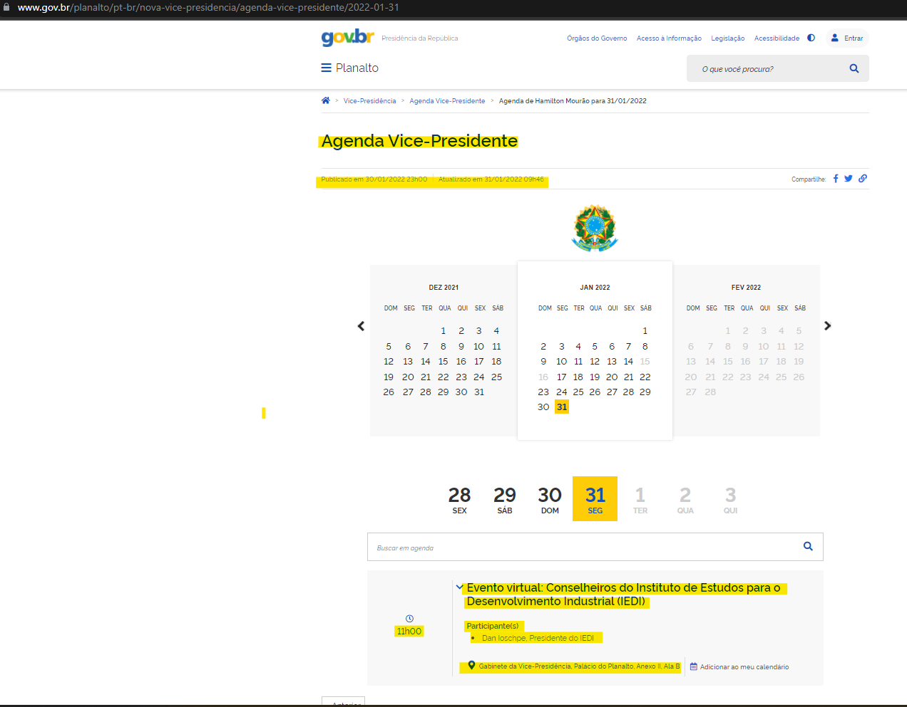
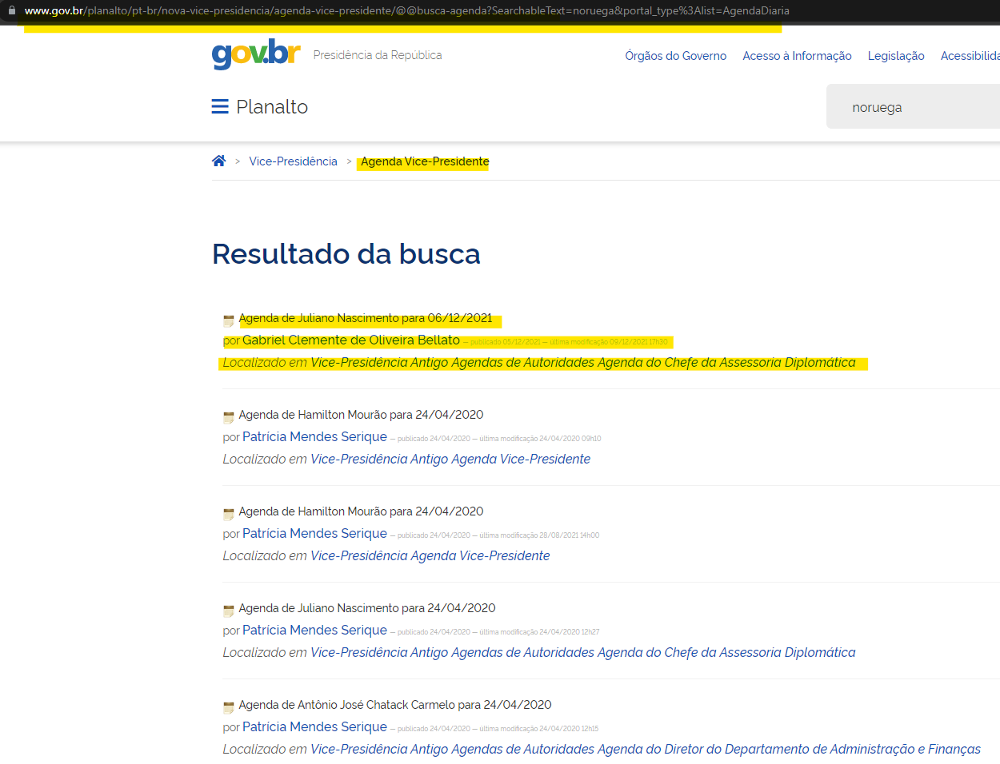

```{r setup, include=FALSE}
knitr::opts_chunk$set(echo = TRUE)
```

Agendas raspadas:

-   Vice-presidente (Hamilton Mourão):
    [link](https://docs.google.com/spreadsheets/d/1fLdVj6_jMU4bbEABwPOAZp1qQ58n5CrpdCt2S3XbJec/edit#gid=0)
-   Resultados de compromissos após a busca pelo termo “noruega”:
    [link](https://docs.google.com/spreadsheets/d/1mdHwtmR37DyvzcjljQ9i-i5nj3BbO7bZvebb9dIpsoI/edit#gid=0)


Exemplo de uma página
([link](https://www.gov.br/planalto/pt-br/nova-vice-presidencia/agenda-vice-presidente/2022-01-31))



Exemplo de uma busca
([link](https://www.gov.br/planalto/pt-br/nova-vice-presidencia/agenda-vice-presidente/@@busca-agenda?SearchableText=noruega&portal_type%3Alist=AgendaDiaria)



-   Código:
    -   Função que extrai os dados de uma página.
        [link](src/raspa-compromissos-da-agenda-oficial.R)
    -   Rotina para extrair várias páginas.
        [link](src/rotina-de-raspagem-por-cargo.R)

